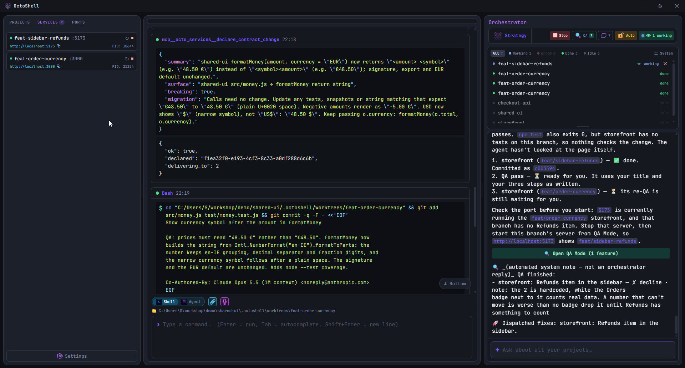
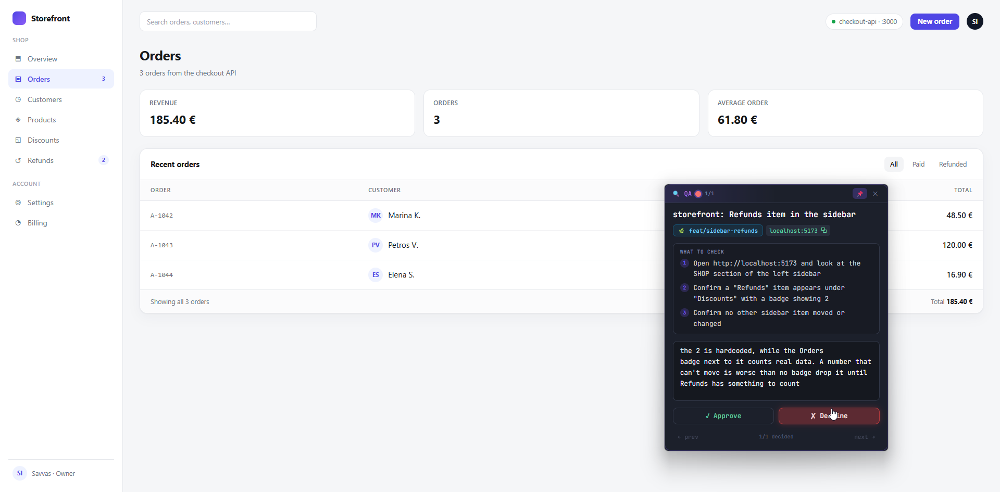
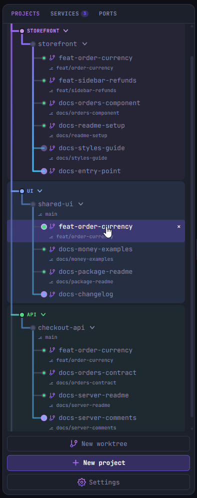

# 🐙 OctoShell

**A desktop workspace for running coding agents, on Windows and macOS.**

You give it a task. It creates a Git worktree, starts an agent in it, and shows you what the agent is doing while it does it. Several can run at once, in different repositories, without touching each other's files.

Built with Tauri v2 and Rust, with a React and TypeScript frontend and xterm.js for the terminals.

[Download the latest release](https://github.com/savvasioakeim/OctoShell/releases/latest) · [Site](https://savvasioakeim.github.io/OctoShell/)



## What it does

**One worktree per task.** Each agent gets its own worktree and branch, so two agents working at the same time never touch the same files. Your own checkout stays where you left it, with no branch switching and no stashing.

**An orchestrator that dispatches.** Type a goal, or hand it a plan. It turns that into tasks, creates a worktree for each, starts an agent, and reports back as they finish. Nothing is dispatched until you confirm it, unless you turn that off.

**Agents that can see related work.** When tasks are connected, the orchestrator says so when it dispatches them. An agent can then read what the others changed and what they declared, which is how a frontend agent learns that the API it calls is about to return a new field.

**Strategy Mode.** For a change worth arguing about first, several agents discuss it in roles such as Architect, Backend, QA and Security, reading the projects you attach as context. You moderate round by round. The result is one report with the goal, the architecture, the decisions, the rejected alternatives, the risks, the open questions, the steps and the acceptance criteria, which you can save, export or execute.

**QA mode.** When an agent finishes something you can see, OctoShell starts that worktree's dev server and puts a small window over your browser with the checklist the agent wrote for its change. You try it yourself, then approve or decline with a note, and the note goes back to that agent as its next task. Past passes stay in a list.



**Managed dev servers and ports.** Agents do not start servers on their own; they ask OctoShell, which starts the server, keeps its log, and lists it next to the ones you started with a note of who asked. Starting one on a port that is taken replaces what was there instead of quietly moving elsewhere. The Ports panel shows what is listening and can kill it.

**A terminal made of command blocks.** Output is a feed of self contained blocks with exact boundaries and exit codes, read from OSC 133 shell integration in Rust rather than guessed from the prompt. Works the same in PowerShell, zsh and bash.

**A step list per agent.** An agent writes down its steps before it starts, through a tool OctoShell gives it, and ticks them off as it goes, so you can see where it is without reading the whole log.

**Smart PR button.** Drives a branch through create, check, update and merge, with the agent resolving review comments on update. Needs an authenticated `gh` CLI.

**Docker sandbox, if you want it.** An ACP agent can run inside a throwaway container with `--cap-drop=ALL`, memory and pid limits, and only its worktree mounted.

**Your phone, when you are away from the desk.** Share the workspace for a chosen length of time to read what agents are doing and answer an approval. Nothing is reachable until you press Start, the access code expires by itself, and letting the phone start new work is a separate switch.

**Which agents.** Claude Code and Gemini CLI directly, plus any agent that speaks the Agent Client Protocol: Codex, OpenCode, Cursor, Copilot, Kiro. Provider, model and approval mode are set per project. Local models through Ollama.

## What it is not

Worth knowing before you install it:

- **Windows first.** macOS works on Apple Silicon and has been tested by the developer who ported it, but most of the hours have gone into Windows. There is no Intel Mac build, because ONNX Runtime ships no prebuilt binary for that target, and no Linux build.
- **A desktop app, not a server.** There is no `npx` command and no Docker deployment that serves a web UI to your team. It runs on your machine, on your repositories.
- **No issue tracker.** There is no Kanban board and no ticket system. Work starts from what you type or from a saved plan.
- **Not private from your model provider.** OctoShell has no server, no account and no telemetry, and your files stay local. But an agent has to send code to its provider to work on it, exactly as it would from that provider's own CLI. Ollama is the exception.
- **Not code signed yet.** Windows SmartScreen and macOS Gatekeeper both warn on first launch. The release notes say which click gets past each one.
- **Young.** Expect rough edges and read the security section below before turning approvals off.

## Coming from Vibe Kanban

[Vibe Kanban](https://github.com/BloopAI/vibe-kanban) is sunsetting, and it covered a lot of the same ground. What maps across:

| Vibe Kanban | OctoShell |
| --- | --- |
| Workspace per task with a branch, terminal and dev server | Git worktree per task, with its own terminal and managed dev server |
| Review diffs and send feedback to the agent from the UI | QA mode: the agent's checklist over the running app, decline with a note that becomes its next task |
| Built in browser preview | Your own browser, with the QA window floating over it |
| Open a PR and merge | Smart PR button: create, check, update, merge |
| Claude Code, Codex, Gemini CLI, Copilot, Cursor, Amp | Claude Code and Gemini CLI directly, the rest over ACP |

What you would lose: the Kanban board, the web UI, Docker self hosting, and Linux. What you would gain: worktrees and terminals that are actually native, agents that can read each other's declared changes, and a planning mode before any code is written.



## Prerequisites

**Windows**
- Windows 10 or 11 with PowerShell 7 (`pwsh`)
- [Tauri prerequisites](https://v2.tauri.app/start/prerequisites/): WebView2 and the MSVC build tools

**macOS**
- macOS 12 or later on Apple Silicon, with Xcode Command Line Tools (`xcode-select --install`)
- The terminal runs your login shell, zsh or bash; `pwsh` works too if you have it

**Both**
- Node.js 18+, Rust 1.85+
- For agents: [Claude Code](https://claude.com/claude-code) (`claude`) or Gemini CLI on PATH, or any ACP agent CLI
- Optional: `gh` CLI for the PR button, Docker Desktop for the sandbox, `cloudflared` for the phone companion over the internet

## Setup and run

```powershell
# Windows
npm install
# Optional: $env:ANTHROPIC_API_KEY = "sk-ant-..."
# Without a key, agents and the orchestrator use your local `claude` CLI login.
npm run tauri dev
```

```bash
# macOS
npm install
# Optional: export ANTHROPIC_API_KEY="sk-ant-..."
npm run tauri dev
```

Release build: `npm run tauri build`. Windows produces an NSIS installer and an MSI, macOS a `.app` and a `.dmg`, under `src-tauri/target/release/bundle/`.

> **Windows SmartScreen:** unsigned builds trigger "Windows protected your PC". Click *More info*, then *Run anyway*.
>
> **macOS Gatekeeper:** an unsigned app is blocked on first launch. Open *System Settings → Privacy & Security*, scroll to Security, and click *Open Anyway*. From a terminal, `xattr -dr com.apple.quarantine /Applications/OctoShell.app` does the same in one step.

## macOS notes

- **Shell integration for zsh and bash.** The same OSC 133 markers PowerShell emits on Windows are injected into zsh (through a `ZDOTDIR` shim that sources your own `.zshrc` first) and bash (through `--rcfile`), so command blocks, exit codes and cwd tracking work identically. Your prompt, aliases and plugins are untouched.
- **PATH.** An app launched from Finder normally gets a bare PATH. OctoShell adopts your login shell's PATH at startup, so Homebrew, nvm and `~/.local/bin` tools are found as they are in Terminal.
- **Tab completion** is served natively, commands on PATH plus file paths, rather than by a PowerShell runspace.
- **Process cleanup.** Windows ties every child to a Job Object; on macOS each dev server and agent runs in its own process group, so stopping one ends its whole tree and a clean exit sweeps them all.
- **Shortcuts** use ⌘ rather than Ctrl: ⌘T new project, ⌘W close, ⌘1 to ⌘9 switch, ⌘⇧K clear. Ctrl+C in the input still interrupts.
- **Worktree dependency copies** use APFS clones (`cp -c`), so copying a large `node_modules` into a new worktree is instant.

How the platform layer is organised, and how to add a shell or an OS: [docs/platforms.md](docs/platforms.md).

## Architecture, short version

```
Frontend (React/Vite)                          Backend (Rust)
─────────────────────                          ──────────────
InputBar ──submit──► ShellController ──write──► pty.rs    PtyManager (pwsh / zsh / bash + OSC 133 injection)
   Feed ◄── snapshot ─────┤◄── pty://events ──            SemanticParser (command boundaries/exit codes)
AiSidebar ──ai_chat──────────────────────────► ai.rs      orchestrator (Anthropic API or claude CLI)
ShellController ──agent_send/acp_send────────► agent.rs   claude/gemini stream-json
                                               acp.rs     any ACP agent (JSON-RPC over stdio)
serviceStore ──service_start─────────────────► service.rs managed dev servers (port alloc, log stream)
                                               docker.rs  sandbox containers (bollard)
```

Every child process is tied to a kill-on-close Windows Job Object, or to a per-child process group on macOS (`jobctl.rs`, `platform.rs`), so closing OctoShell never orphans a shell, an agent or a dev server.

## Security posture, read this

- With approval mode off, which is the default, agents run with `--dangerously-skip-permissions`: they can execute any command in your project without asking. The per-project **Approve** toggle makes Bash, Edit and Write calls ask first.
- Orchestrator actions are confirm-per-click unless you enable Auto. A session spend limit in Settings halts everything when it is hit.
- The Docker sandbox isolates the host from agent commands. It does not protect the worktree itself and does not prevent network exfiltration: the mounted worktree is read-write and networking is on, because installs need it.
- Macros never run by themselves. They put a command in the input for you to approve.

## Contributing

See [CONTRIBUTING.md](CONTRIBUTING.md). Good places to start: ACP agent definitions in `src/agents/providers.ts`, service detection patterns, translations.

## License

[MIT](LICENSE)
